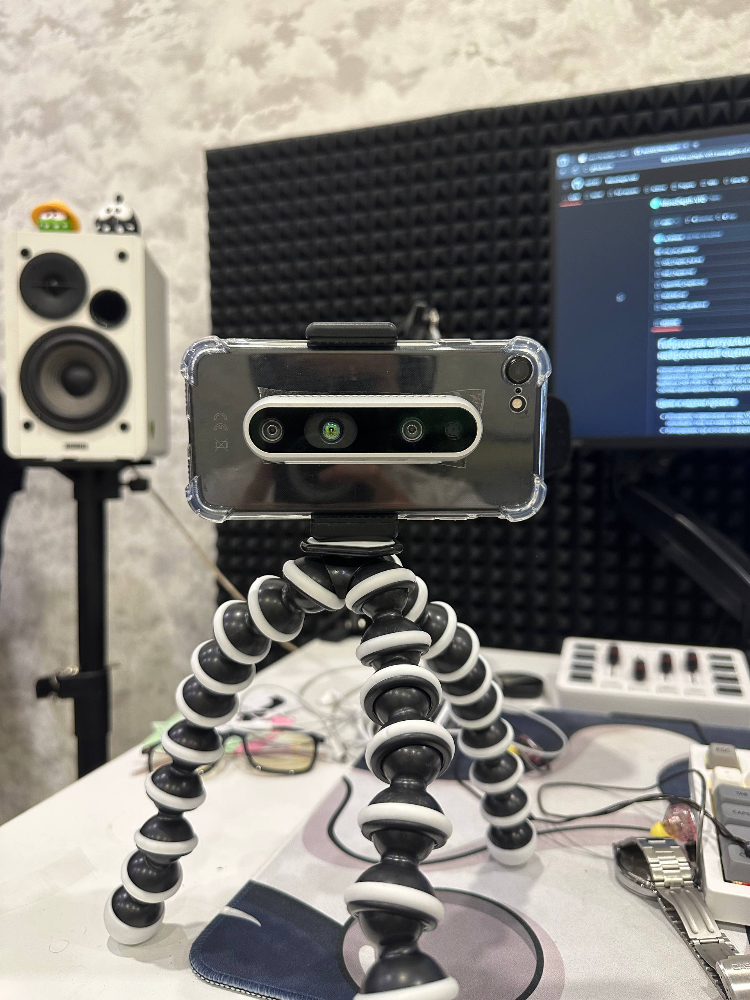

# Гибридная визуально-инерциальная одометрия с нейросетевой оценкой глубины

Репозиторий содержит реализацию и экспериментальный стенд для гибридной системы визуально-инерциальной одометрии (VIO), объединяющей классический MSCKF-подход (OpenVINS), данные Intel RealSense D435 (RGB-D) + внешняя IMU и нейросетевую оценку глубины на основе Depth Anything 3 (DA3). Система ориентирована на работу в реальном времени.

## Цели и задачи проекта

- Исследовать теоретические основы VIO и расширенного фильтра Калмана с учётом pre-integration IMU и скользящего окна поз камеры (MSCKF).
- Интегрировать три источника информации о глубине: RGB-D камера RealSense, нейросетевая глубина (Depth Anything / Depth Anything 3) и триангуляция в OpenVINS.
- Реализовать гибридную схему адаптивного взвешивания измерений глубины с учётом доверия сенсоров, расстояния и текстурности сцены.
- Оценить точность, устойчивость и вычислительную сложность.

## Теоретическая база

В теоретической части проекта рассмотрены:

- Классическая архитектура визуально-инерциальной одометрии, включая формулировку MSCKF, структуру вектора состояния и процедуру маргинализации поз камер.
- Мультисенсорная интеграция IMU (акселерометры, гироскопы, опционально магнитометр), их ошибки, дрейфы и способы компенсации с помощью EKF.
- Модели монокулярной и RGB-D оценки глубины, особенности масштабной неоднозначности и её устранение с помощью метрической глубины RealSense и/или DA3Metric.
- Математическая интеграция depth-измерений в EKF через добавление резидуалов глубины, вычисление якобианов и использование Mahalanobis gating для отбрасывания выбросов.

## Основные компоненты системы

Система включает несколько взаимосвязанных модулей:

- **OpenVINS (MSCKF VIO)**  
  Используется как базовая платформа визуально-инерциальной одометрии с поддержкой IMU pre-integration, скользящего окна поз камер и расширенного фильтра Калмана.

- **Модуль IMU**  
  Описывает архитектуру и практическое использование инерциальных датчиков, в том числе встроенной IMU Bosch BMI055 в RealSense D435i и возможных внешних IMU, с акцентом на высокочастотное предсказание состояния и снижение задержки.
  В нашем проекте в качестве IMU датчика будет использоваться Iphone, а вместо Intel RealSense D435i, Intel RealSense D435.

- **Модуль глубины (Depth Anything 3)**  
  Использует серию моделей DA3 (в первую очередь DA3-Small/DA3-Base) для оценки глубины и параметров камеры, а также для потенциального объединения метрической и относительной геометрии сцены.

- **RGB-D камера Intel RealSense D435i**  
  Обеспечивает метрическую глубину в диапазоне 0.3–10 м и синхронизированные RGB и IMU данные, что решает проблему масштаба в монокулярном VIO и повышает устойчивость системы.

- **Гибридный EKF-ядро**  
  Расширяет классический MSCKF за счёт включения глубинных измерений от RealSense и нейросетевых карт глубины с адаптивным взвешиванием и согласованием масштаба.

## Архитектура и ROS-интеграция

Целевой стек предполагает использование ROS/ROS2 для интеграции камеры, IMU и алгоритмов одометрии:

- Узел `realsense2_camera` публикует потоки `/camera/color/image_raw`, `/camera/depth/image_rect_raw`, `/camera/*/camera_info` и IMU-топики.
- Внешняя или встроенная IMU обрабатывается узлом `imu_driver` (ROS 1/ROS 2), публикующим данные в `sensor_msgs/Imu` на топик `/imu_raw`.
- Фильтр `robot_localization` (EKF) выполняет первичную фьюзию IMU с одометрией/визуальной информацией и выдаёт `/odometry/filtered` для использования в навигации.
- Отдельный узел DA3/Depth Anything получает RGB-кадры, выполняет нейросетевой инференс глубины и/или параметров камеры и передаёт результаты в ядро VIO.

Подробный рабочий пример интеграции D435 с внешней IMU через ROS и `robot_localization` приведён в `ros_imu_d435_guide.md`.

## Целевая аппаратная платформа

Проект рассчитан на встраиваемое исполнение:

- Камера Intel RealSense D435 как основной RGB-D и IMU сенсор.

## Структура репозитория

Основные файлы и главы:

- `README.md` — краткое описание проекта и инструкции верхнего уровня (данный файл).
- `Theoretical_Basis_Final_Verified.md` — полная теоретическая база гибридной VIO и EKF.
- `IMU_Chapter.md` — глава о принципах работы IMU, их характеристиках и практической интеграции.
- `OpenVINS_Chapter.md` — описание платформы OpenVINS, MSCKF и сравнительный анализ современных VIO-систем.
- `DA3_Chapter_Full.md` — глава по Depth Anything 3, архитектуре, сериям моделей и применению на встраиваемых системах.
- `ros_imu_d435_guide.md` — практический ROS-гайд по интеграции RealSense D435 с IMU.

## Установка и запуск (кратко)

Ниже приведён упрощенный сценарий установки, основанный на текущем прототипе и исходном README модуля глубины.

1. **Клонирование репозитория и Python-зависимости**

   - Установить Python 3.9.x.  
   - Создать и активировать виртуальное окружение.  
   - Установить зависимости:
     ```bash
     pip install -r requirements.txt
     pip install .
     ```

2. **Установка ROS/ROS2, RealSense**

   - Установить соответствующие ROS-пакеты.
   - Настроить launch-файлы для камеры D435, IMU и EKF согласно `ros_imu_d435_guide.md`.

3. **Загрузка весов Depth Anything 3**

   - Скачать предварительно обученные веса (например, `DA3METRIC-LARGE` или `DA3-BASE`) и разместить в директории `weights` в соответствии с документацией модуля глубины.

4. **Запуск основного скрипта/узла**

   - Для локального инференса с камеры:
     ```bash
     python infer_camera.py
     ```
   - Для ROS-интеграции — запуск соответствующего launch-файла/узла в структуре проекта.

Конкретные команды и структура пакетов могут отличаться в зависимости от финальной организации кода в ветке `main`; актуальные инструкции следует поддерживать в данном README и в подпапках `docs` или `launch`.

## Лицензия и использование

Проект опирается на открытые решения OpenVINS, Intel RealSense SDK и Depth Anything 3, распространяемые под соответствующими лицензиями их авторов. Пользователь обязан соблюдать условия лицензий исходных проектов и уважать права разработчиков и правообладателей при использовании кода, моделей и данных.



